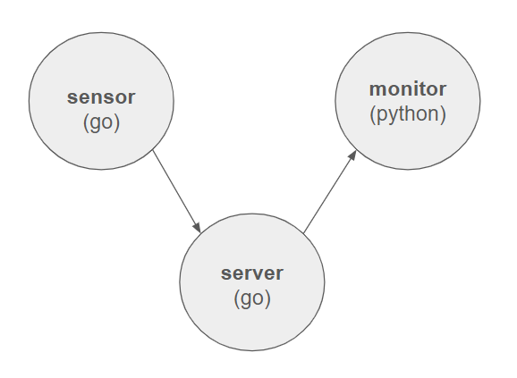
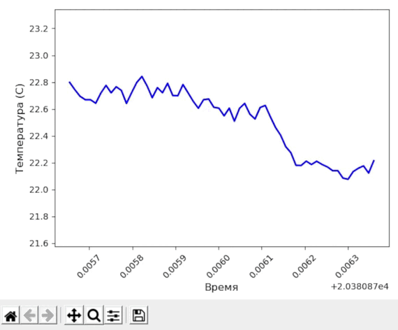

# Система телеметрии
Система состоит из трёх микросервисов, передающих данные через gRPC. Система разработана пригодной для дальнейшего масштабирования.



### Sensor
Сервис Sensor генерирует значения температуры, случайно меняющиеся кажду секунду на ±0.1 градус, и передаёт данные на сервер.

### Server
Сервер получает данные от сенсоров, и отправляет их сервисам-подпичикам.

### Monitor
Сервис на Python получает поток данных от сервера, и визуализирует их в реальном времени.



## Установка
Убедитесь, что у вас установлены Go и Python.
Клонируйте репозиторий на своё устройство и перейдите в корень директории.
Затем в одном терминале запустите server:
```
cd server
go run server.go
```

Во втором терминале запустите sensor:
```
cd sensor
go run temperature.go
```

В третьем терминале установите зависимости и запустите визуализацию данных:
```
cd monitor
pip install -r requirements.txt
python main.py
```
